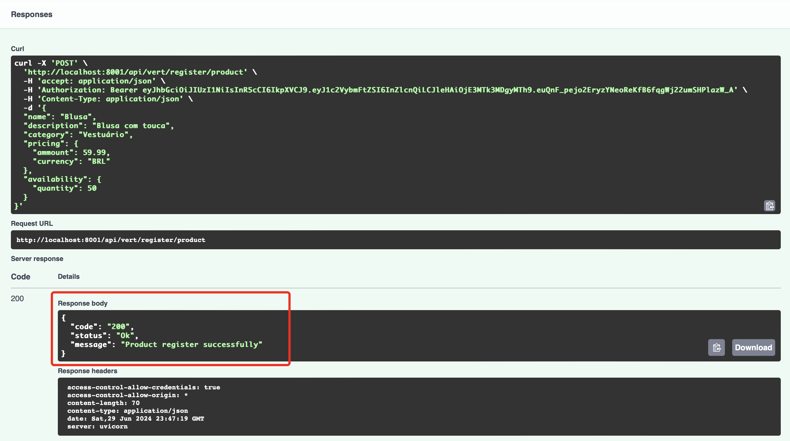

# Dataflow Kafka-Postgres-Python

Este projeto tem como objetivo criar um sistema distribuído que realiza o recebimento, persistência e produção de dados. A solução utiliza Kafka, Python e PostgreSQL para garantir a eficiência e escalabilidade na gestão e processamento dos dados.


## Tecnologias Usadas

- Kafka: Plataforma de streaming distribuído usada para a ingestão e distribuição de dados em tempo real.
- Python: Linguagem de programação escolhida para o desenvolvimento dos consumidores e produtores de dados, devido à sua versatilidade e vasta gama de bibliotecas.
- PostgreSQL: Banco de dados relacional utilizado para a persistência dos dados, escolhido por sua robustez e suporte a operações transacionais complexas.
## Estrutura do Projeto (Ver mais em screenshots)

- /src
    -- 
    A pasta src contém todo o código-fonte do projeto, organizado de maneira modular para facilitar a manutenção, e escalabilidade. 
    Ela inclui os módulos principais da aplicação, configurações, utilitários etc.
- /src/config
    --
    A pasta config é responsável por armazenar todas as configurações e definições de ambiente necessárias para a aplicação. 
    Isso inclui configurações para diferentes ambientes, bem como variáveis de ambiente específicas e arquivos de configuração.
- /src/controller
    --
    A pasta controller é responsável por gerenciar a lógica de controle da aplicação, atuando como intermediária entre a camada de serviços e a camada de apresentação (geralmente APIs ou interfaces de usuário). 
    Ela processa as solicitações recebidas, invoca os serviços apropriados e retorna as respostas correspondentes.
- /src/kafka
    -- 
    A pasta kafka é responsável por encapsular toda a lógica relacionada à interação com o Kafka. 
    Isso inclui a configuração e utilização dos produtores e consumidores de Kafka.
- /src/model
    --
    A pasta model é responsável por definir os modelos de dados utilizados na aplicação. 
    Esses modelos geralmente representam entidades do domínio da aplicação e são usados para interagir com o banco de dados. 
    A definição dos modelos inclui a estrutura das tabelas, relacionamentos entre elas e quaisquer comportamentos específicos associados às entidades.
- /src/repositoy
    --
    A pasta repository é responsável por encapsular a lógica de acesso e manipulação dos dados no banco de dados. 
    Ela atua como uma camada intermediária entre os modelos de dados e os serviços da aplicação, fornecendo uma interface limpa e métodos específicos para realizar operações CRUD (Create, Read, Update, Delete) e outras consultas necessárias.
- /src/router
    --
    A pasta router é responsável por definir e gerenciar as rotas da aplicação. 
    Ela atua como um ponto central onde todas as rotas da API são registradas e associadas às funções de controle apropriadas. 
    Isso facilita a organização e a manutenção das rotas da aplicação.
- /src/schema
    --
    A pasta schema é responsável por definir os esquemas de dados utilizados na aplicação, geralmente para validação e serialização/deserialização de dados. 
    Esses esquemas são usados para garantir que os dados recebidos e enviados pela API estejam no formato correto e atendam aos requisitos especificados.
- /src/service
    --
    A pasta service é responsável por conter a lógica de negócios da aplicação. 
    Os serviços utilizam os repositórios para acessar e manipular os dados, aplicando regras de negócios específicas e garantindo que a lógica de aplicação seja mantida de forma centralizada e organizada.
- /src/app.py
    --
    O arquivo app.py é o ponto de entrada principal da aplicação. 
    Ele configura e inicia o servidor web, registra as rotas, inicializa os serviços e define quaisquer middlewares necessários.

- main.py
    --
    O arquivo main.py é o ponto de entrada principal para a execução da aplicação. 
    Ele configura e inicializa a aplicação, incluindo o servidor web, rotas, banco de dados, e outros serviços necessários.
## Funcionalidades

- Autenticação do usuário.
- Casdastro de um produto.
- Consulta de produtos cadastrados
- Envio de mensagens para um tópico do kafka.
- Consumo de mensagens de um tópico no Kafka


## Variáveis de Ambiente

`ENVIRON`

`TIMEZONE`

`USERNAME_API`

`PASSWORD_API`

`DATABASE`

`DATABASE_HOST`

`DATABASE_USER`

`DATABASE_PASSWORD`

`KAFKA_HOST`

`TOPIC_PRODUCTS`

`CONSUMER_GROUP`


## Documentação da API

#### Retorna um token

```http
  POST /api/vert/auth/login
```


| Parâmetro   | Tipo       | Descrição                           |
| :---------- | :--------- | :---------------------------------- |
| `username` | `string` | **Obrigatório**. Nome do usuário (vert) |
| `password` | `string` | **Obrigatório**. Senha do usuário (vert) |

#### Cadastra um produto

```http
  POST /api/vert/register/product 
```

| Parâmetro   | Tipo       | Descrição                                   |
| :---------- | :--------- | :------------------------------------------ |
| `name`      | `string` | **Obrigatório**. Nome do produto|
| `description`      | `string` | **Obrigatório**. Descrição do produto|
| `category`      | `string` | **Obrigatório**. Categoria do produto|
| `pricing {ammount}`      | `float` | **Obrigatório**. Valor do produto|
| `pricing {currency}`      | `string` | **Obrigatório**. Moeda (BRL)|
| `availability {quantity}`      | `integer` | **Obrigatório**. Quantidade do produto|


#### Consulta os produtos cadastrados (Para fins de teste)

```http
  GET /api/vert/product/all 
```


#### Consome as mensagem de um tópico no Kafka (Para fins de teste)

```http
  GET /api/vert/kafka/consumer/product
```


#### Acessa a documentação da API

```http
  GET /docs
```


## Configuração do ambiente e execução da aplicação
Pré-requisitos (Consultar instalação para o ambiente a ser usado: Linux, Mac, Windows)
 - Python 3.8 ou superior
 - Docker
 - Docker Compose

Após instalação do recursos acima, quando estiver dentro da pasta da aplicação, para iniciar digite:

```bash
docker-compose up
```

ou

```bash
docker-compose up -d
```

 

## Instruções para a criação e configuração dos tópicos no Kafka e da tabela no PostgreSQL

A aplicação está configurada para iniciar e configurar automaticamente os recursos necessários tanto no Kafka quanto no PostgreSQL. Isso inclui a criação de tópicos no Kafka e a configuração das tabelas no PostgreSQL. A seguir, você encontrará uma descrição de como esse processo é gerenciado pela aplicação e o que você precisa saber para garantir que tudo funcione corretamente.

#### Configuração Automática de Tópicos no Kafka

Os tópicos do Kafka são configurados automaticamente usando as variáveis de ambiente definidas no arquivo .env e no arquivo docker-compose.yml. Isso significa que não é necessário criar manualmente os tópicos no Kafka antes de iniciar a aplicação. As variáveis de ambiente relevantes incluem:

- KAFKA_HOST: O endereço do servidor Kafka.
- TOPIC_PRODUCTS: O nome do tópico para produtos (ex.: produtos-persistidos).

#### Configuração Automática de Tabelas no PostgreSQL

As tabelas do PostgreSQL são criadas automaticamente quando a aplicação é iniciada. Isso é gerenciado pela função initialize_db() que é chamada durante o evento de inicialização da aplicação. As configurações do banco de dados são especificadas nas variáveis de ambiente no arquivo .env e no arquivo docker-compose.yml como:

- DATABASE_HOST: O endereço do servidor PostgreSQL.
- DATABASE_USER: O nome de usuário do banco de dados.
- DATABASE_PASSWORD: A senha do banco de dados.
- DATABASE: O nome do banco de dados.

#### Inicialização da Aplicação

Quando a aplicação é iniciada, ela executa a configuração automática dos tópicos e das tabelas através do evento de inicialização definido no código. Veja o trecho de código abaixo que exemplifica essa configuração:

```bash
from fastapi import FastAPI

app = FastAPI()

@app.on_event("startup")
async def startup_event():
    initialize_db()
    add_user(USERNAME_API, PASSWORD_API)
```
- initialize_db(): Função responsável por criar as tabelas no PostgreSQL.
- add_user(USERNAME_API, PASSWORD_API): Função que adiciona um usuário inicial ao sistema.


## Screenshots (Iniciando os serviços)

#### Iniciando a aplicação

#### Subindo os serviços

#### Download das imagens feita com sucesso

#### Contâiners 100%

#### Acessando a API

#### Rota principal


## Screenshots (Banco de dados)
#### Diagrama

#### Tabelas

#### Tabela User

#### Tabela Produto

#### Tabela Pricing

#### Tabela Availability


## Screenshots (Kafka UI)


## Observações
 - O id do produto é gerado automaticamente na inserção do registro.
 - O timestamp é gerado automaticamente na inserção do registro.
 - O json para cadastro do produto foi separado em tabelas para armazenamento em um banco de dados
relacional, priorizando a normalização dos dados (1,2 e 3), redução de redundância e anomalias nos dados, manutenção e escabilidade


## Autores

- [@romariovieira](https://github.com/romariovieira777)

